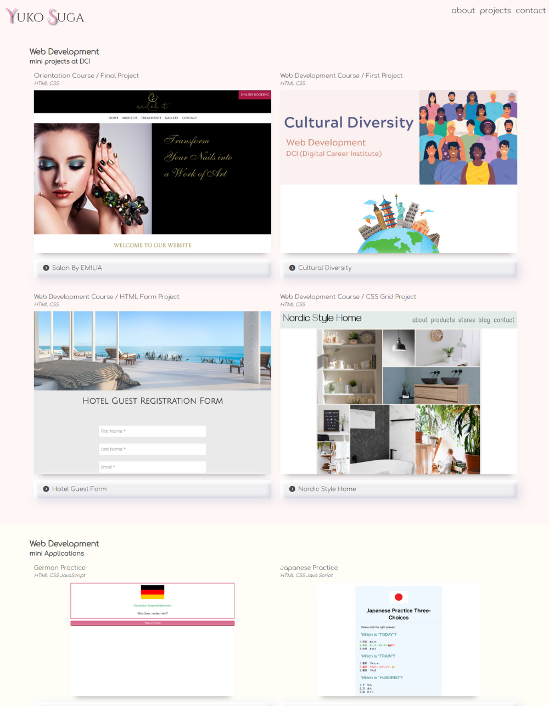

# My Portfolio 👩🏻‍💻✨
## This is my portfolio repository.
Click here to visit the website.  
🔗[Yuko Suga Portfolio](https://yukosuga.github.io/portfolio/) 👩🏻‍💻
### Tools I used
-  HTML
-  CSS
-  Sass
-  Linux
-  Bootstrap
-  Visual Studio Code
-  Canva

 
